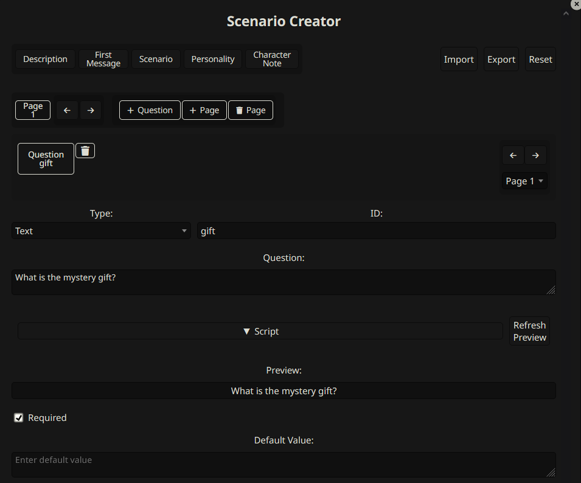
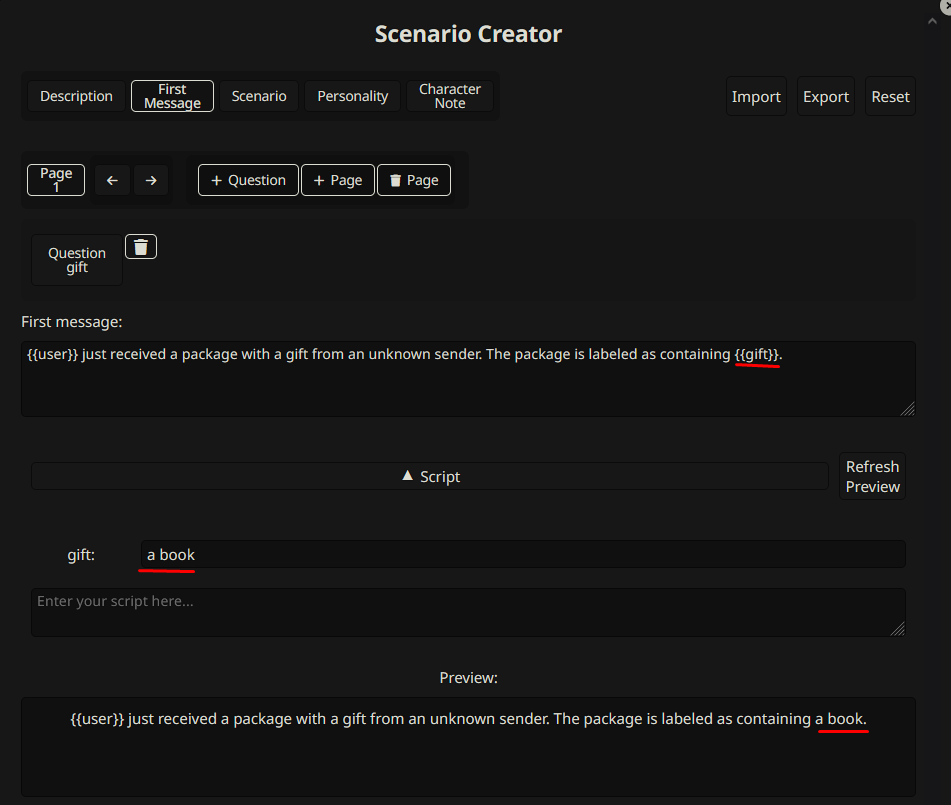

# SillyTavern Custom Scenario

An extension that lets you create interactive scenarios with variables and basic scripting.

## What it does
- Create scenarios with custom questions
- Use variables in the description/first message/personality/scenario/character note.
- Add simple scripts to make things dynamic. (JavaScript)
- Import/export scenarios as JSON/PNG

## Question types
- Text input
- Dropdown select
- Checkbox

## How to use

### Create a scenario

Click the puzzle icon on the character create/edit sidebar.


Fill out the form.





Open _script_ accordion and test it with the preview button




Export it.

### Play a scenario

Click the play icon on the characters sidebar and select the JSON/PNG file.


Fill inputs.


Created card


## Simple scripting
You can write basic JavaScript to manipulate variables. For example:

If your description is:
```
{{user}} just received a package with a gift from an unknown sender. The package is labeled as containing {{gift}}.

You also received a card with the following message: {{occasionMessage}}
```

Assume this was the answer to the question:
```yml
gift: "a book"
message: "birthday"
# As you see, there is no `occasionMessage`
```

You can write a script for setting `occasionMessage`
```js
variables.occasionMessage = "Happy " + variables.message + "! Enjoy your new " + variables.gift;
```

Output will be:
```
{{user}} just received a package with a gift from an unknown sender. The package is labeled as containing a book.

You also received a card with the following message: Happy birthday! Enjoy your new book
```

## Scripting Details
* `variables` is an object that holds all the variables.
* All variables can be accessed and modified.
* Example usage: (Let's say question id is `gift`)
    * If question type is _text_, `variables.gift`
    * If the question type is _dropdown_, `variables.gift.value` and `variables.gift.label`. When creating the card, `variables.gift.label` is used.
    * If question type is _checkbox_, `variables.gift`. (boolean)


## FAQ:
### Why did you create this?
I saw this on [AIDungeon](https://play.aidungeon.com/) and liked it. You can see in this [reddit post](https://www.reddit.com/r/SillyTavernAI/comments/1i59jem/scenario_system_similar_to_ai_dungeon_nsfw_for/) with an example.

### Why version is _0.3.1_
It is because of UI, not functionality.

## Known Issues
* Exported character lorebook might not work as expected. However, you can reselect this after a new card is created.
