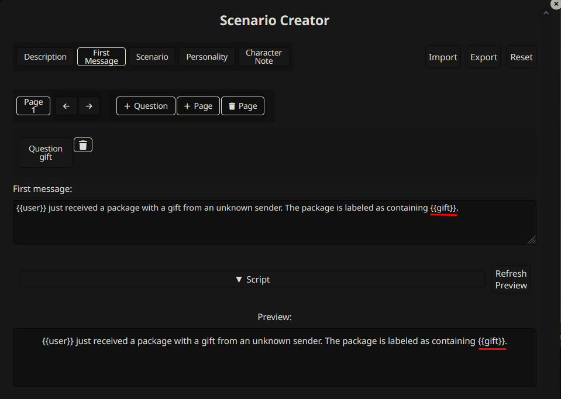

# SillyTavern Custom Scenario

A [SillyTavern](https://docs.sillytavern.app/) extension that allows you to create and play interactive character cards.  Want to customize the scenario before starting? Define character traits, starting location, or any other key element through a series of questions!

## Key Features

*   **Custom Scenarios:** Design scenarios with tailored question prompts.
*   **Dynamic Variables:** Use the answers to those questions as variables within the description, first message, personality, scenario notes, and character notes.
*   **Simple Scripting (JavaScript):**  Add dynamic logic and complex variable manipulation.
*   **Import/Export:** Share and backup your creations as JSON or PNG files.
*   **Question Types:**  Supports Text input, Dropdown select, and Checkbox options.

## Installation

Install via the SillyTavern extension installer:

```txt
https://github.com/bmen25124/SillyTavern-Custom-Scenario
```

## How to Use

### 1. Create a Scenario

1.  Click the puzzle icon on the character create/edit sidebar.

    

2.  Fill out the form in the "Create Scenario" dialog.

    
    

3.  Open the *Script* accordion and test your scripting logic with the "Preview" button.

    

4.  Export your completed scenario.

### 2. Play a Scenario

1.  Click the play icon on the characters sidebar and select the JSON/PNG file containing your scenario.

    

2.  Fill in the inputs in the "Play Scenario" dialog.

    

3.  Your character card will be created with the scenario applied!

    

## Example Cards

Check out the [rentry page (half NSFW)](https://rentry.co/custom-scenario-creator-examples) for example scenarios. Import these into the "Create Scenario" dialog to see how the scripting works.

## Simple Scripting

You can use basic JavaScript to manipulate variables based on user input.

**Example:**

If your description is:

```
{{user}} just received a package with a gift from an unknown sender. The package is labeled as containing {{gift}}.

You also received a card with the following message: {{occasionMessage}}
```

And the user answers the questions:

```yml
gift: "a book"
message: "birthday"
# As you can see, there is no `occasionMessage` defined yet.
```

You can use a script to set the `occasionMessage`:

```javascript
variables.occasionMessage = `Happy {{message}}! Enjoy your new {{gift}}`;
```

or

```javascript
variables.occasionMessage = `Happy ${variables.message}! Enjoy your new ${variables.gift}`;
```

or

```javascript
variables.occasionMessage = "Happy " + variables.message + "! Enjoy your new " + variables.gift;
```

The output will be:

```
{{user}} just received a package with a gift from an unknown sender. The package is labeled as containing a book.

You also received a card with the following message: Happy birthday! Enjoy your new book
```

## Scripting Details

*   `variables` is an object that holds all the user-provided answers (variables).
*   All variables can be accessed and modified within your scripts.
*   **Example Usage (Question ID: `gift`):**

    *   **Text Input:** `variables.gift` (The text entered by the user)
    *   **Dropdown Select:** `variables.gift.value` (The selected value) and `variables.gift.label` (The displayed label).  The `label` is used when creating the card.
    *   **Checkbox:** `variables.gift` (A boolean: `true` if checked, `false` if not).

*   **Show Script:** This script determines whether a question is displayed in the "Play Scenario" dialog.  Example: `return variables.gift === "birthday"` will only show the question if the `gift` variable is "birthday".
*   In the preview, empty variables are displayed as `{{variable}}`.  In the created character card, these empty variables are not shown.
*   **Accessing Lorebook Entries:**

    *   **Get a single Lorebook entry:** `await world.getFirst({name?: string, keyword: string})`. *name* is optional, and defaults to the character lorebook.

        ```javascript
        const info = await world.getFirst({keyword: "triggerWord"});
        if (info) {
            variables.f_companion_content = info.content;
        }
        ```

    *   **Get all Lorebook entries:** `await world.getAll({name?: string, keyword: string})`. *name* is optional, and defaults to the character lorebook.

        ```javascript
        const infos = await world.getAll({keyword: "triggerWord"});
        if (infos && infos.length > 0) {
            variables.f_companion_content = infos[0].content;
        }
        ```

## FAQ

### Why did you create this?

I was inspired by the scenario system in [AIDungeon](https://play.aidungeon.com/). See this [Reddit post](https://www.reddit.com/r/SillyTavernAI/comments/1i59jem/scenario_system_similar_to_ai_dungeon_nsfw_for/) for an example.

### Why is the version number *0.4.5*?

The version number reflects UI changes, not core functionality updates.

## Known Issues

*   Character tags are not currently imported from the scenario files. I plan to add an extension setting to enable/disable the "Import Tags" dialog in a future update.
